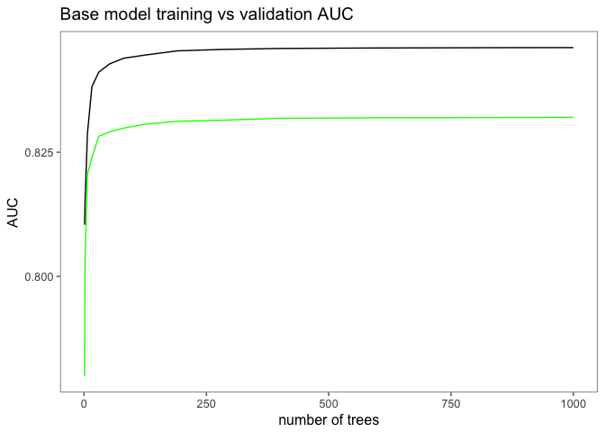
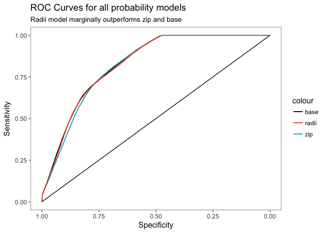
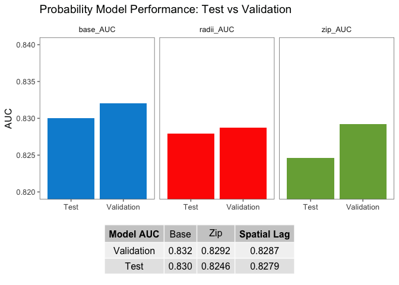
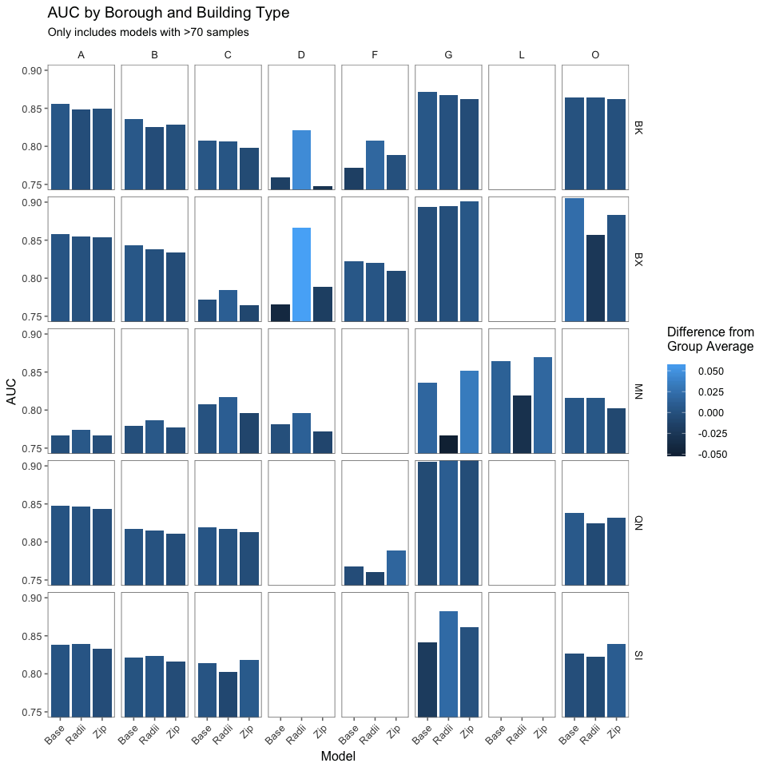
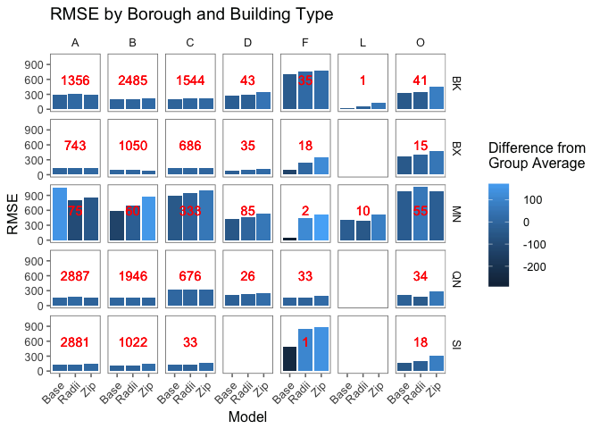

Exploration of results
================

*Questions* - Does Spatial Lag model outperform base? zip? - How does model performance break down by borough? - What are the characteristics of areas where radii modeling works well?

``` r
library(tidyverse)
library(gridExtra)
library(h2o)
library(ggthemes)
library(sf)
```

PROBABILITY model data
======================

``` r
prob_base_data <- read_rds("results/prob/p09_prob_of_sale_model_base.rds")
prob_zip_data <- read_rds("results/prob//p10_prob_of_sale_model_zipcode.rds")
prob_radii_data <- read_rds("results/prob/p11_prob_of_sale_model_radii.rds")
prob_evals <- read_rds("results/p15_prob_model_evaluations.rds")

ls()[grep("prob", ls())]
```

    ## [1] "prob_base_data"  "prob_evals"      "prob_radii_data" "prob_zip_data"

What is the overall AUC of the probability model?
=================================================

AUC of the base model on validation set is `0.8320345`

``` r
prob_base_data$model@model$scoring_history %>% 
  filter(number_of_trees>0) %>% 
  ggplot()+
  aes(x = number_of_trees)+
  geom_line(aes(y = training_auc), color = "black")+
  geom_line(aes(y = validation_auc), color = "green")+
  ggthemes::theme_few()+
  labs(title = "Base model training vs validation AUC"
       , y = "AUC"
       , x = "number of trees")
```



ROC Curves on validation data
=============================

``` r
# function to compute TPR and FPR
simple_roc <- function(labels, scores){
  labels <- labels[order(scores, decreasing=TRUE)]
  df <- data_frame(TPR=cumsum(labels)/sum(labels), FPR=cumsum(!labels)/sum(!labels), labels)
  df$Specificity = 1-df$FPR
  df$Sensitivity = df$TPR
  df
}

base_roc <- simple_roc(prob_base_data$actual, prob_base_data$probs)
zip_roc <- simple_roc(prob_zip_data$actual, prob_zip_data$probs) 
radii_roc <- simple_roc(prob_radii_data$actual, prob_radii_data$probs) 

ggplot()+
  geom_line(data = base_roc, aes(x = Specificity, y = Sensitivity, color = "base"))+
  geom_line(data = zip_roc, aes(x = Specificity, y = Sensitivity, color = "zip"))+
  geom_line(data = radii_roc, aes(x = Specificity, y = Sensitivity, color = "radii"))+
  geom_line(data = data_frame(x = c(1,0), y = c(0,1)), aes(x = x, y = y), color = "black")+
  scale_x_reverse()+
  ggthemes::theme_few()+
  scale_color_manual(values=c("black","#ed5729","#01afc7"))+
  labs(title = "ROC Curves for all probability models"
       , subtitle = "Radii model marginally outperforms zip and base")
```



Does spatial lag probability model outperform base? Zip?
========================================================

Answer: Yes, marginally so. The models fit to the validation set about equally as well, but the radii model outperforms the other two models incrementally when generalizing to the test data.

Here is the data:

``` r
prob_val_metrics <- 
  data_frame(type = "Validation"
             , base_AUC = prob_base_data$model@model$validation_metrics@metrics$AUC
             , zip_AUC = prob_zip_data$model@model$validation_metrics@metrics$AUC
             , radii_AUC = prob_radii_data$model@model$validation_metrics@metrics$AUC)

prob_test_metrics <- 
  data_frame(type = "Test"
             , base_AUC = prob_evals$base
             , zip_AUC = prob_evals$Zip
             , radii_AUC = prob_evals$Radii)

prob_results_table <- bind_rows(prob_val_metrics, prob_test_metrics)
prob_results_table
```

    ## # A tibble: 2 x 4
    ##         type  base_AUC   zip_AUC radii_AUC
    ##        <chr>     <dbl>     <dbl>     <dbl>
    ## 1 Validation 0.8320345 0.8292006 0.8287313
    ## 2       Test 0.8300389 0.8246017 0.8279034

Here is a chart of performance

``` r
tt <- ttheme_default(colhead=list(fg_params = list(parse=TRUE)))
prob_results_table_plot <- tableGrob(prob_results_table, rows=NULL, theme=tt)

prob_results_plot <- 
  bind_rows(prob_val_metrics, prob_test_metrics) %>% 
  gather(Var, Value, -type) %>% 
  ggplot()+
  aes(x = type, y = Value, fill = Var)+
  geom_col(position = "dodge")+
  facet_wrap(~Var)+
  coord_cartesian(ylim = c(0.82,0.84))+
  ggthemes::scale_fill_fivethirtyeight()+
  ggthemes::theme_few()+
  theme(legend.position = "none")+
  labs(title = "Probability Model Performance: Test vs Validation"
       , x = NULL
       , y = "AUC")

grid.arrange(prob_results_plot, prob_results_table_plot,nrow=2, heights = c(3,1))
```



Are there certain areas where radii model performs better?
==========================================================

``` r
# function to compute AUC quickly
fastAUC <- function(probs, class) {
  x <- probs
  y <- class
  x1 = x[y==1]; n1 = length(x1); 
  x2 = x[y==0]; n2 = length(x2);
  r = rank(c(x1,x2))  
  auc = (sum(r[1:n1]) - n1*(n1+1)/2) / n1 / n2
  return(auc)
}


by_boro_base <- data_frame(Borough = prob_base_data$Borough$Borough, Actual = prob_base_data$actual, Prob = prob_base_data$probs, Pred = prob_base_data$pred)
by_boro_zip <- data_frame(Borough = prob_zip_data$Borough$Borough, Actual = prob_zip_data$actual, Prob = prob_zip_data$probs, Pred = prob_zip_data$pred)
by_boro_radii <- data_frame(Borough = prob_radii_data$Borough$Borough, Actual = prob_radii_data$actual, Prob = prob_radii_data$probs, Pred = prob_radii_data$pred)


list(by_boro_base, by_boro_zip, by_boro_radii) %>% 
  map(function(x){
    split(x, f = x$Borough) %>% 
      map_dbl(~fastAUC(.x$Prob, .x$Actual))
  }) %>% 
  reduce(c) %>% 
  matrix(ncol = 5, byrow = T) %>% 
  as_data_frame() %>% 
  set_names(nm = c("BK","BX","MN","QN","SI")) %>% 
  mutate(Model = c("Base","Zip","Radii")) %>% 
  select(Model, BK, BX, MN, QN, SI) %>% 
  mutate_at(vars(BK:SI), funs(round(.,4)))
```

    ## # A tibble: 3 x 6
    ##   Model     BK     BX     MN     QN     SI
    ##   <chr>  <dbl>  <dbl>  <dbl>  <dbl>  <dbl>
    ## 1  Base 0.8309 0.8288 0.7926 0.8338 0.8336
    ## 2   Zip 0.8234 0.8215 0.7796 0.8283 0.8281
    ## 3 Radii 0.8257 0.8312 0.8031 0.8327 0.8348

Do any of the models perform best for certin building types?
============================================================

Interstingly, the model performs exceptionally on Elevator Buildings (Buidling Type D). AUC of the base model is 0.76, compared to the radii model AUC of 0.80. The intuitive explanation here is that Elevator Buildings are more commoditized, i.e., there are far more of them than any other type of commerical building. It makes a fair bit of sense that residential buildings would follow a more strict pattern of gentrification, given their higher propensity to sell as well as people's tendencies to move en masse to a single area.

``` r
by_buildtype_base <- data_frame(Building_Type = prob_base_data$Building_Type$Building_Type, Actual = prob_base_data$actual, Prob = prob_base_data$probs, Pred = prob_base_data$pred)
by_buildtype_zip <- data_frame(Building_Type = prob_zip_data$Building_Type$Building_Type, Actual = prob_zip_data$actual, Prob = prob_zip_data$probs, Pred = prob_zip_data$pred)
by_buildtype_radii <- data_frame(Building_Type = prob_radii_data$Building_Type$Building_Type, Actual = prob_radii_data$actual, Prob = prob_radii_data$probs, Pred = prob_radii_data$pred)


list(by_buildtype_base, by_buildtype_zip, by_buildtype_radii) %>% 
  map(function(x){
    split(x, f = x$Building_Type) %>% 
      map_dbl(~fastAUC(.x$Prob, .x$Actual))
  }) %>% reduce(c) %>% 
  matrix(ncol = 8, byrow = T) %>% 
  as_data_frame() %>% 
  set_names(nm = c("A","B","C","D","F","G","L","O")) %>% 
  mutate(Model = c("Base","Zip","Radii")) %>% 
  select(Model, A,B,C,D,F,G,L,O) %>% 
  mutate_at(vars(A:O), funs(round(.,4)))
```

    ## # A tibble: 3 x 9
    ##   Model      A      B      C      D      F      G      L      O
    ##   <chr>  <dbl>  <dbl>  <dbl>  <dbl>  <dbl>  <dbl>  <dbl>  <dbl>
    ## 1  Base 0.8461 0.8286 0.8071 0.7681 0.7773 0.8789 0.8534 0.8395
    ## 2   Zip 0.8419 0.8222 0.7982 0.7602 0.7923 0.8809 0.8698 0.8336
    ## 3 Radii 0.8433 0.8229 0.8113 0.8037 0.8048 0.8896 0.8134 0.8380

Is there a particularly outstanding subset of model results at the intersection of Building Type and Borough?
=============================================================================================================

Elevator buildings in Brooklyn and the Bronx beenefit especially well from

``` r
by_both_base <- data_frame(Building_Type = prob_base_data$Building_Type$Building_Type
                           , Borough = prob_base_data$Borough$Borough
                           , bbl = prob_base_data$bbl$bbl
                           , Actual = prob_base_data$actual, Prob = prob_base_data$probs, Pred = prob_base_data$pred) %>% mutate(Model = "Base")

by_both_zip <- data_frame(Building_Type = prob_zip_data$Building_Type$Building_Type
                          , Borough = prob_zip_data$Borough$Borough
                          , bbl = prob_base_data$bbl$bbl
                          , Actual = prob_zip_data$actual, Prob = prob_zip_data$probs, Pred = prob_zip_data$pred) %>% mutate(Model = "Zip")


by_both_radii <- data_frame(Building_Type = prob_radii_data$Building_Type$Building_Type
                            , Borough = prob_radii_data$Borough$Borough
                            , bbl = prob_base_data$bbl$bbl
                            , Actual = prob_radii_data$actual, Prob = prob_radii_data$probs, Pred = prob_radii_data$pred) %>% mutate(Model = "Radii")

bind_rows(by_both_base, by_both_zip, by_both_radii) %>% 
  group_by(Borough, Building_Type, Model) %>% 
  summarise(AUC = fastAUC(Prob, Actual)
            , Count = n()) %>% 
  mutate_all(function(x) ifelse(is.infinite(x), 0, x)) %>% 
  filter(Count>70) %>% 
  mutate(Group_Av = mean(AUC, na.rm = T)
         , `Difference From Group Average` = AUC-Group_Av) %>% 
  ggplot()+
  aes(x = Model, y = AUC, fill = `Difference From Group Average`)+
  geom_col()+
  facet_grid(Borough~Building_Type)+
  coord_cartesian(ylim = c(.75,.9))+
  ggthemes::theme_few()+
  theme(axis.text.x = element_text(angle = 45,hjust = 1, vjust = 1))+
  labs(title = "AUC by Borough and Building Type"
       , subtitle = "Only includes models with >70 samples"
       , fill = "Difference from\nGroup Average")
```



Map of correctly predicted sales
================================

``` r
correct_predictions <- 
  by_both_radii %>% 
  mutate(ColorKey = ifelse(Actual==1 & Pred==1, "TP","Other")
         , ColorKey = ifelse(Actual==0 & Pred==0, "TN",ColorKey)
         , ColorKey = ifelse(Actual==0 & Pred==1, "FP",ColorKey)
         , ColorKey = ifelse(Actual==1 & Pred==0, "FN",ColorKey)
  )
# map in lat/lon
bbl_coords <- read_rds("utils/bbl_coords_sf.rds")
correct_predictions_coords <- correct_predictions %>% left_join(bbl_coords, by = 'bbl') %>% st_as_sf(sf_column_name = "geometry", crs = 4326)
```

SALES Model Data
================

``` r
sales_base_data = read_rds("results/sales/p12_sale_price_model_base.rds")
sales_zip_data = read_rds("results/sales/p13_sale_price_model_zipcode.rds")
sales_radii_data = read_rds("results/sales/p14_sale_price_model_radii.rds")
sales_evals <- read_rds("results/p16_sales_model_evaluations.rds")
ls()[grep("sales", ls())]
```

    ## [1] "sales_base_data"  "sales_evals"      "sales_radii_data"
    ## [4] "sales_zip_data"

``` r
sales_val_metrics <- 
  data_frame(type = "Validation"
             , base = sales_base_data$model@model$validation_metrics@metrics$RMSE
             , zip = sales_zip_data$model@model$validation_metrics@metrics$RMSE
             , radii = sales_radii_data$model@model$validation_metrics@metrics$RMSE)

sales_test_metrics <- 
  data_frame(type = "Test"
             , base = as.numeric(sales_evals[1,"Test_RMSE"])
             , zip = as.numeric(sales_evals[2,"Test_RMSE"])
             , radii = as.numeric(sales_evals[3,"Test_RMSE"]))

sales_model_RMSE <- bind_rows(sales_val_metrics, sales_test_metrics)
write_rds(sales_model_RMSE, "sales model evaluations.rds")
sales_model_RMSE
```

    ## # A tibble: 2 x 4
    ##         type     base      zip    radii
    ##        <chr>    <dbl>    <dbl>    <dbl>
    ## 1 Validation 280.6314 297.9717 286.2295
    ## 2       Test 287.8305 300.6031 297.9202

``` r
sales_base_data$model@model$scoring_history %>% 
  filter(number_of_trees>0) %>% 
  ggplot()+
  aes(x = number_of_trees)+
  geom_line(aes(y = training_rmse), color = "black")+
  geom_line(aes(y = validation_rmse), color = "green")+
  labs(title = "Base model training vs validation RMSE"
       , y = "RMSE")
```


``` r
sales_base_data$model@model$scoring_history %>% 
  filter(number_of_trees>0) %>% 
  ggplot()+
  aes(x = number_of_trees)+
  geom_line(aes(y = training_mae), color = "black")+
  geom_line(aes(y = validation_mae), color = "green")+
  labs(title = "Base model training vs validation MAE"
       , y = "MAE")
```


Does the RMSE vary across boroughs and building types?

``` r
rmse <- function(error) {
  sqrt(mean(error^2))
}

sales_by_both_base <- data_frame(Building_Type = sales_base_data$Building_Type$Building_Type
                                 , Borough = sales_base_data$Borough$Borough
                                 , bbl = sales_base_data$bbl$bbl
                                 , Actual = sales_base_data$actual
                                 , Pred = sales_base_data$pred) %>% 
  mutate(Model = "Base")

sales_by_both_zip <- data_frame(Building_Type = sales_zip_data$Building_Type$Building_Type
                                , Borough = sales_zip_data$Borough$Borough
                                , bbl = sales_zip_data$bbl$bbl
                                , Actual = sales_zip_data$actual
                                , Pred = sales_zip_data$pred) %>% 
  mutate(Model = "Zip")


sales_by_both_radii <- data_frame(Building_Type = sales_radii_data$Building_Type$Building_Type
                                  , Borough = sales_radii_data$Borough$Borough
                                  , bbl = sales_radii_data$bbl$bbl
                                  , Actual = sales_radii_data$actual
                                  , Pred = sales_radii_data$pred) %>% 
  mutate(Model = "Radii")


bind_rows(sales_by_both_base, sales_by_both_zip, sales_by_both_radii) %>% 
  mutate(error = Actual - Pred) %>% 
  group_by(Borough, Building_Type, Model) %>% 
  summarise(RMSE = rmse(error)
            , Count = n()) %>% 
  filter(Building_Type!="G") %>% 
  mutate_all(function(x) ifelse(is.infinite(x), 0, x)) %>% 
  #filter(Count>70) %>% 
  mutate(Group_Av = mean(RMSE, na.rm = T)
         , `Difference From Group Average` = RMSE-Group_Av) %>% 
  ggplot()+
  aes(x = Model, y = RMSE, fill = `Difference From Group Average`)+
  geom_col()+
  geom_text(aes(x = "Radii", y = 600, label = Count), color = "red")+
  facet_grid(Borough~Building_Type)+
  #coord_cartesian(ylim = c(.75,.9))+
  ggthemes::theme_few()+
  theme(axis.text.x = element_text(angle = 45,hjust = 1, vjust = 1))+
  labs(title = "RMSE by Borough and Building Type"
       #, subtitle = "Only includes models with >70 samples"
       , fill = "Difference from\nGroup Average")
```



Average rank, RMSE by borough and building type

``` r
average_model_rank_rmse <- 
  bind_rows(sales_by_both_base, sales_by_both_zip, sales_by_both_radii) %>% 
  mutate(error = Actual - Pred) %>% 
  group_by(Borough, Building_Type, Model) %>% 
  summarise(RMSE = rmse(error)
            , Count = n()) %>% 
  mutate_all(function(x) ifelse(is.infinite(x), 0, x)) %>% 
  ungroup() %>% 
  group_by(Borough, Building_Type) %>% 
  mutate(Model_rank = rank(RMSE)) %>% 
  ungroup() %>% 
  group_by(Model) %>% 
  summarise(`Average Rank` = mean(Model_rank)) %>% 
  mutate(Model = ifelse(Model=="Radii", "Spatial Lag", Model)) %>% 
  mutate(`Average Rank` = round(`Average Rank`,2))

write_rds(average_model_rank_rmse, "average sales model rank rmse.rds")

average_model_rank_rmse
```

    ## # A tibble: 3 x 2
    ##         Model `Average Rank`
    ##         <chr>          <dbl>
    ## 1        Base           1.39
    ## 2 Spatial Lag           2.11
    ## 3         Zip           2.50

How often does spatial lag outperform zip?

``` r
bind_rows(sales_by_both_base, sales_by_both_zip, sales_by_both_radii) %>% 
  mutate(error = Actual - Pred) %>% 
  group_by(Borough, Building_Type, Model) %>% 
  summarise(RMSE = rmse(error)
            , Count = n()) %>% 
  mutate_all(function(x) ifelse(is.infinite(x), 0, x)) %>% 
  ungroup() %>% 
  group_by(Borough, Building_Type) %>% 
  mutate(Model_rank = rank(RMSE)) %>% 
  ungroup() %>% 
  select(Borough, Building_Type,Model, Model_rank) %>% 
  filter(Model!="Base") %>% 
  spread(Model, Model_rank) %>% 
  mutate(radii_wins = ifelse(Radii<Zip, 1,0)) %>% 
  summarise(radii_wins = sum(radii_wins), count = n(), percent = radii_wins/count)
```

    ## # A tibble: 1 x 3
    ##   radii_wins count   percent
    ##        <dbl> <int>     <dbl>
    ## 1         26    36 0.7222222

``` r
bind_rows(sales_by_both_base, sales_by_both_zip, sales_by_both_radii) %>% 
  mutate(error = Actual - Pred) %>% 
  group_by(Borough, Building_Type, Model) %>% 
  summarise(RMSE = rmse(error)
            , Count = n()) %>% 
  mutate_all(function(x) ifelse(is.infinite(x), 0, x)) %>% 
  ungroup() %>% 
  group_by(Borough, Building_Type) %>% 
  mutate(Model_rank = rank(RMSE)) %>% 
  ungroup() %>% 
  select(Borough, Building_Type,Model, Model_rank) %>% 
  group_by(Model, Model_rank) %>% 
  summarise(count = n()) %>% 
  ungroup() %>% 
  mutate(percent = scales::percent(count/sum(count))) %>% 
  mutate(Model = ifelse(Model=="Radii", "Spatial Lag", Model)) %>% 
  select(-count) %>% 
  spread(Model_rank, percent) %>% 
  rename("Model Rank" = Model) -> rmse_model_rank_disto

write_csv(rmse_model_rank_disto, "model rank perc distribution table.csv")

rmse_model_rank_disto
```

    ## # A tibble: 3 x 4
    ##   `Model Rank`   `1`   `2`   `3`
    ## *        <chr> <chr> <chr> <chr>
    ## 1         Base 22.2%  9.3%  1.9%
    ## 2  Spatial Lag  5.6% 18.5%  9.3%
    ## 3          Zip  5.6%  5.6% 22.2%
